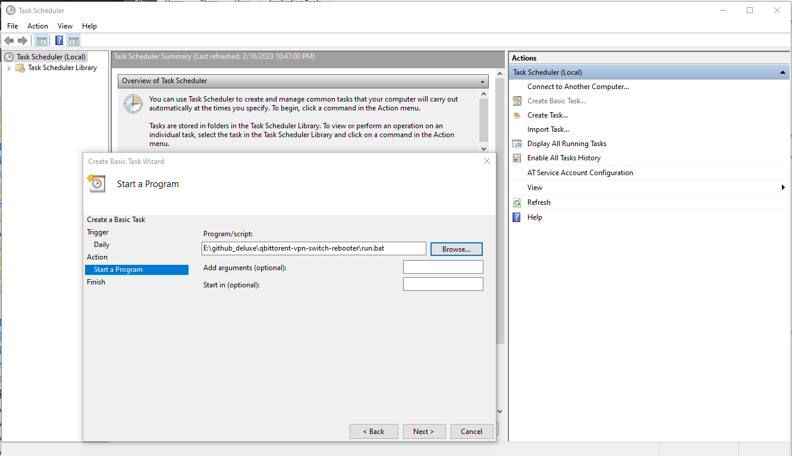
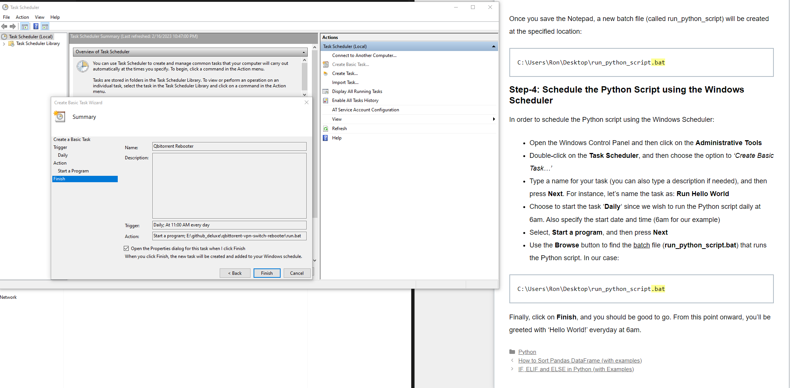

# qbittorent-vpn-switch-rebooter

This script detects whether the running qBittorent instance (using the webUi plugin over localhost) needs to be rebooted due to no torrents actually downloading. This frequently happens after the VPN changes IP addresses and qBittorent fails to update.

## Install
1. Add a shorcut to qbittorent to this folder and rename it to "qtshortcut".
2. Run `pip install qbittorrent-api`
3. Run `python main` whenever. Use the Windows Scheduler Service.

## Windows Scheduler Service

Use this to automate running this rebooter task whenever you like.

